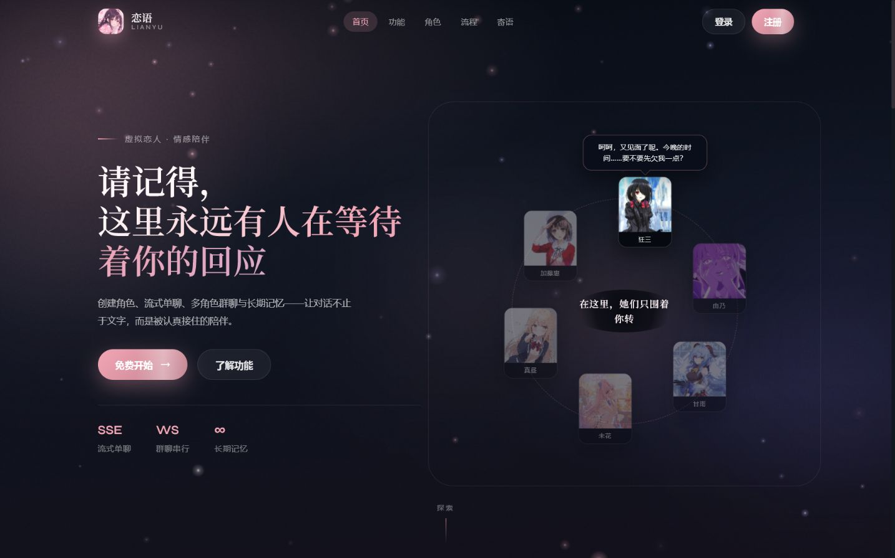
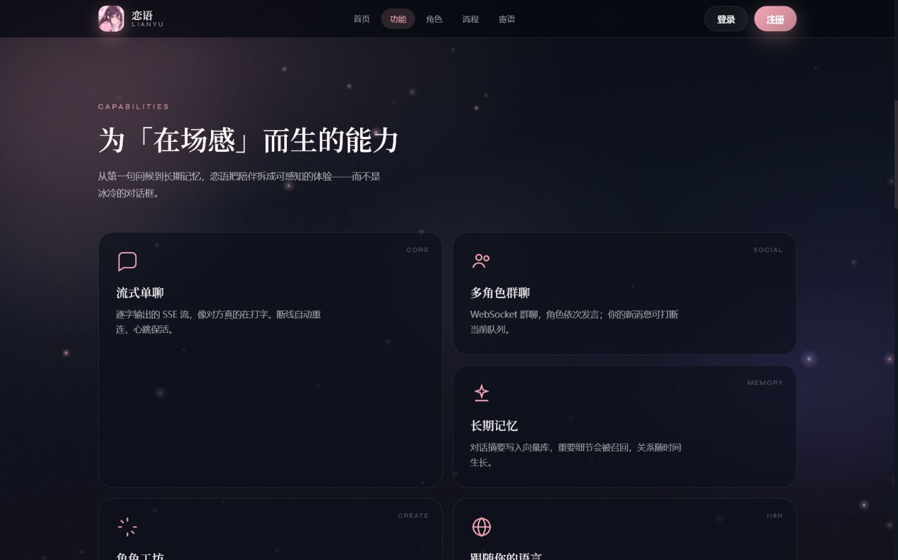
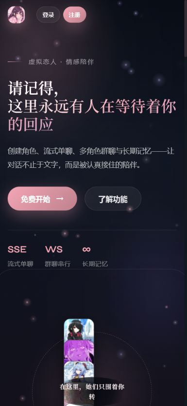

# LianYu-PC

[](https://github.com/liuwanwan1/LianYuPC/actions/workflows/ci.yml)
[](LICENSE)
[](https://github.com/liuwanwan1/LianYuPC/releases)

恋语是一个 AI 角色陪伴桌面/Web 应用。它把角色聊天、长期记忆、主动陪伴、桌面感知和多角色关系放在同一套可自托管系统中。

## Screenshots And Demo

[观看 18 秒产品演示（MP4）](docs/demo/lianyu-demo.mp4)

| 桌面首页 | 核心能力 |
|---|---|
|  |  |

<p align="center"></p>

## Features

- 自定义角色、角色广场和多角色群聊
- 单聊 SSE 流式回复与群聊 WebSocket/STOMP
- 主动开场、未回复节流、夜间免打扰和关系阶段演化
- MySQL 长期记忆、可选 Milvus 语义检索、命中审计与用户删除控制
- Electron 像素桌宠、前台窗口感知和明确授权后的屏幕观察
- 任意公网 OpenAI 兼容接口、Ollama，以及本地模式下的 LM Studio/LocalAI/vLLM
- SillyTavern Character Card V1/V2 PNG/JSON 导入和 V2 导出
- 简中、繁中、英语和日语界面

## Quick Start

### Lite mode

Lite 模式适合第一次体验：不启动 Milvus，不需要 TLS 证书，记忆语义搜索自动回退到 MySQL。需要 Docker Desktop 24+，建议至少 8GB 可用内存。

```powershell
powershell -NoProfile -ExecutionPolicy Bypass -File scripts/init-local.ps1
docker compose -f docker-compose.yml -f docker-compose.lite.yml up -d --build
```

打开 <http://localhost:8088>。首次构建通常需要几分钟；`.env` 中的本地密码由脚本随机生成，不会进入 Git。

停止服务：

```powershell
docker compose -f docker-compose.yml -f docker-compose.lite.yml down
```

### Full mode

Full 模式启用 Milvus 和 TLS API 网关，适合长期部署。先在 `certs/server.crt` 和 `certs/server.key` 放入证书，再运行：

```bash
cp .env.example .env
# 修改 .env 中的密码、LIANYU_MASTER_KEY 和域名配置
docker compose up -d --build
```

生产环境必须保持 `LIANYU_AI_ALLOW_PRIVATE_BASE_URLS=false`，并使用可信证书、强随机密码和独立的 `LIANYU_MASTER_KEY`。

## AI Providers

登录后进入“设置 -> AI 配置”，填写：

| Field | Example |
|---|---|
| 配置别名 | `DeepSeek`、`Local` |
| Base URL | `https://api.deepseek.com`、`http://host.docker.internal:1234/v1` |
| API Key | 服务商密钥；可信本地服务可留空 |
| 默认模型 | `deepseek-chat`、本地模型 ID |

公网地址默认执行 SSRF 防护。本地和私网地址只有在 `LIANYU_AI_ALLOW_PRIVATE_BASE_URLS=true` 时可用；Lite Compose 已仅为本地环境开启该选项。

## Character Cards

“我的羁绊”页面支持导入 `.png` 或 `.json`：

- 接受 Tavern Card V1 和 Character Card V2。
- 保留未知的 V2 字段、扩展和 alternate greetings，避免往返导出丢数据。
- PNG 使用生态通用的 `chara` 元数据块。
- 每个角色可导出为 V2 PNG 或 JSON。

导入内容可能包含第三方 Prompt 或角色设定，请在使用前自行审阅其来源和授权。

## Memory And Privacy

- 每个角色可以单独关闭长期记忆；关闭后不再提取或召回。
- 记忆页支持查看来源消息、删除单条、按角色清空或全部清空。
- 命中记录只保存查询哈希、路径、记忆 ID 和时间，不保存原始提问；默认保留 30 天。
- 屏幕观察默认关闭，开启前显示授权说明，关闭后主进程立即停止观察任务。
- Lite 模式不使用 Milvus；数据库仍保存结构化记忆，并使用最近重要记忆作为回退。

更多安全约定见 [SECURITY.md](SECURITY.md)。

## Architecture

```text
Vue 3 / Electron
       |
Spring Boot REST + SSE + WebSocket
       |
Service: chat / character / memory / relationship / moments
       |
MySQL + Redis + RabbitMQ + MinIO + optional Milvus
```

后端为 JDK 17、Spring Boot 3.3 多模块项目；前端为 Vue 3、Vite 5、Element Plus 和 Pinia。详细模块边界见 [backend/README.md](backend/README.md)、[frontend/README.md](frontend/README.md) 和 [CLAUDE.md](CLAUDE.md)。

## Development

```bash
# Backend
cd backend
mvn -B test

# Frontend Web
cd frontend
npm ci --ignore-scripts
npm run dev
npm run test -- --run
```

Electron 完整安装和打包需要 Node.js 20、Python 3 与 Windows C++ 构建工具：

```powershell
cd frontend
npm ci
npm run electron:dev
```

## Release

发布版本号在前端 `package.json` 与后端 Maven Reactor 中保持一致。维护者完成验证后创建同名 tag：

```bash
git tag v0.3.0-rc.1
git push origin v0.3.0-rc.1
```

Release workflow 会重新运行前后端测试、构建 Windows 安装包、生成 SHA-256 校验文件并创建 GitHub Release。变更记录见 [CHANGELOG.md](CHANGELOG.md)。

## Contributing

请阅读 [CONTRIBUTING.md](CONTRIBUTING.md)。提交代码前不要把 `.env`、证书、API Key、聊天数据或安装包加入仓库。

## License

Copyright 2026 LianYu-PC contributors. Licensed under the [Apache License 2.0](LICENSE).
